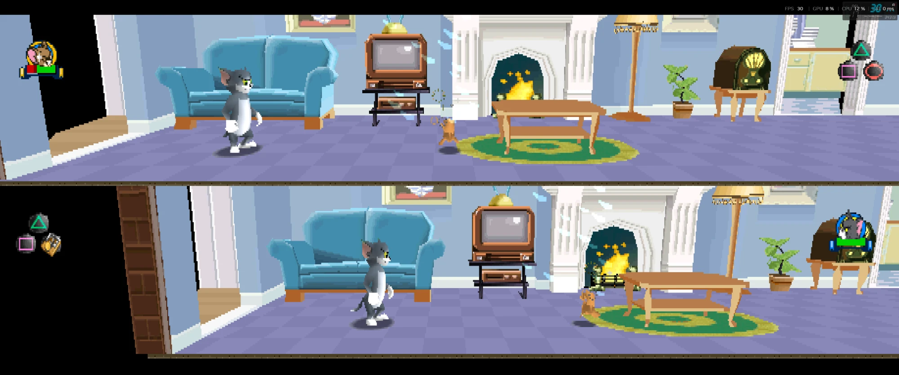
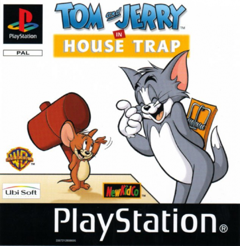

# TomJerry Recompiled

<!-- retcomm-readme-metrics -->
[](https://github.com/IraFunesto/TomJerryRecomp/releases)
[](https://github.com/IraFunesto/TomJerryRecomp/releases/latest)
[](https://github.com/IraFunesto/TomJerryRecomp/releases/latest)
<!-- /retcomm-readme-metrics -->

<p align="center">
  
</p>

Static recompilation of **Tom and Jerry in House Trap** (PlayStation, PAL
SLES-03181) built on [psxrecomp](https://github.com/mstan/psxrecomp) and
[recomp-ui](https://github.com/RetroPortingToolKit/recomp-ui). The game runs
as native code on your PC, compiled from your own disc, with a widescreen mod
and quality-of-life fixes on top.



| | |
|---|---|
| Players | 2 (split screen, netplay) |
| Region | PAL (Europe) |
| Publisher | Ubi Soft / NewKidCo |
| Year | 2000 |

## What this adds

All enhancements live in the bundled **Tom & Jerry Widescreen** mod package
(launcher → Mods) and can be switched off.

**Widescreen** (16:9, 21:9, 32:9 or fit to window) — a real wider field of
view, not a stretched picture:
- the whole room is drawn at the screen edges: props, walls and the full
  floor, which the original only built for a 4:3 window around the camera;
- the HUD (portraits, health bars, button prompts) is anchored to the corners
  of the wide screen, in both split-screen views;
- the split-screen separator, the pause menu, LOADING screens and menus are
  handled cleanly: no leftover images at the sides, menus stay 4:3.

**HUD size** — 100 / 85 / 75 / 65 % (default 75 %): the low-resolution HUD art
is drawn smaller so it looks sharper next to the high-resolution game.

**Frame rate** — 30 fps on NTSC timing (default), the speed the game was
designed for; the PAL release runs at 25 fps and never compensated. Music is
unchanged. 25 fps PAL remains available.

**VSync on high-refresh monitors** — no tearing on 120/144/165 Hz screens
without G-SYNC or driver tweaks, game speed unchanged.

**Fixes**
- LOADING screens are centred (no black band, no cut-off bottom).
- Italian text fix: "SI" in the pause and options menus was an orange block
  (the font has no accented I); it now reads correctly.
- Netplay disc check fixed for the standard Redump dump.

Plus everything psxrecomp provides: high internal resolution, texture
filtering, save states, netplay with rollback, controller rumble.

## How to play

1. Download the latest zip from
   [Releases](https://github.com/IraFunesto/TomJerryRecomp/releases/latest)
   and extract it into a new folder.
2. Run `TomJerry_Recompiled.exe` (Python 3 required).
3. Select your own disc (.cue/.bin) and follow the **Generate & rebuild**
   wizard: the game is compiled on your PC.
4. Enable **Widescreen** in the launcher's Mods page.

The download contains no game data and no Sony BIOS; OpenBIOS (MIT-licensed)
is used when you do not provide your own.

<!-- retcomm-readme-launcher -->
## Retro Launcher

You can run this title **standalone** (release zip + the built-in recomp-ui
Generate & Build flow), or manage installs, updates, ROM/BIOS wiring, and queued
builds more intuitively with
**[Retro Launcher](https://github.com/RetroPortingToolKit/Retro-Launcher)** —
the Retro Compilation Manager hub for self-compiling recomps.

[Downloads](https://github.com/RetroPortingToolKit/Retro-Launcher/releases) ·
[Full README & features](https://github.com/RetroPortingToolKit/Retro-Launcher#readme)

<p align="center">
  
</p>

<p align="center">
  
</p>

Retro checks for updates, rebuilds with existing build data when possible,
shares the portable toolchain used by per-title launchers, and automates
BIOS/ROM/save plumbing so you are not stuck repeating each game’s wizard by hand.
<!-- /retcomm-readme-launcher -->

## Legal

You must own the original game. Disc images under `disc/` are gitignored and
must never be committed. Retail BIOS dumps are not redistributed; OpenBIOS is
used for Generate unless you supply your own SCPH locally.

App icon: Tom, cropped from the PAL cover (`assets/psxrecomp.ico` / `.png`). Windows builds embed it via `APP_ICON`.

Optional box art under `launcher_assets/img/` may come from
[libretro-thumbnails](https://github.com/libretro-thumbnails/libretro-thumbnails)
(`Named_Boxarts`); see `BOXART_SOURCE.txt` when present.

## Quick start (dev)

```bash
git submodule update --init --recursive
./psxrecomp/tools/ci/build_emitters.sh
python3 psxrecomp/psxrecomp_cli.py generate \
  --config game.toml --project-root . --disc disc/<your>.cue
cmake -S . -B build-release -G Ninja -DCMAKE_BUILD_TYPE=Release
cmake --build build-release --target psx-runtime
```

Zip prefix for CI artifacts: `tomjerry`.

## Symbols

Progressive map: `symbols.toml` → `python3 tools/sync_symbols.py` →
`psx_symbols.h` (`PSX_FN_*`). See `psxrecomp/docs/SYMBOLS.md`.

## Framework pins

Submodule gitlinks (`psxrecomp`, optional `recomp-ui`, nested `recomp-net`)
are authoritative. `framework_pins.txt` is an optional scaffold snapshot;
release CI logs SHAs with `record_pins.sh` but builds whatever the gitlinks
resolve to. Bump submodules deliberately — do not float on `main`/`master`
in release CI.

<!-- retcomm-readme-raid -->
---

<p align="center">
  <sub><b>R.A.I.D. — Retro AI Development</b> · a Discord for AI-assisted retro reverse-engineering, decomp &amp; recomp</sub>
</p>

<p align="center">
  <a href="https://discord.gg/Ad9BwSzctP"></a>
</p>
<!-- /retcomm-readme-raid -->
